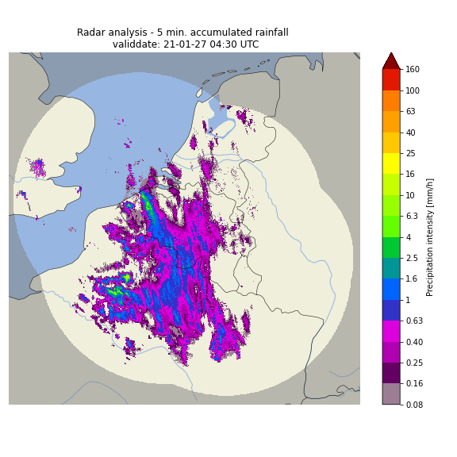
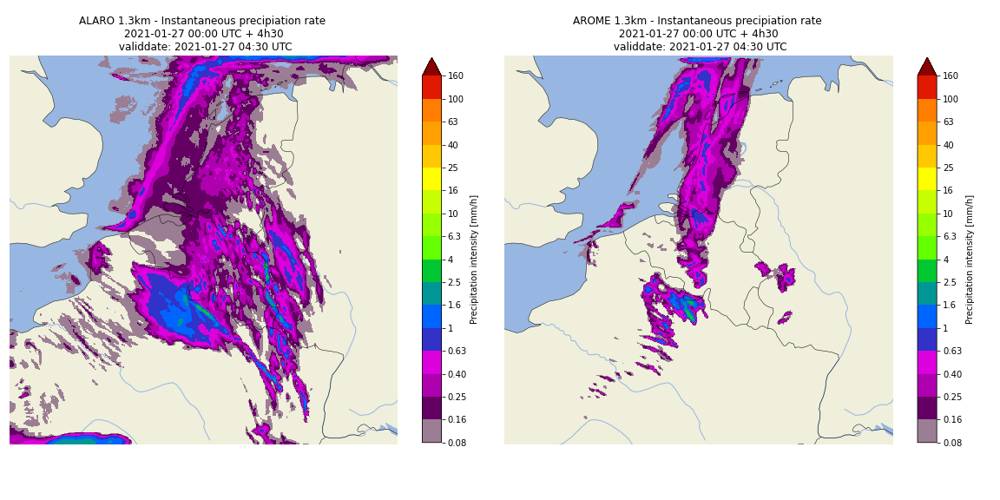

The pySTEPS-BE probabilistic nowcast product
==============================================

.. _pysteps:

pySTEPS
-------

`pySTEPS <https://pysteps.github.io/>`_ (python Short-Term Ensemble Prediction System) is a community-driven initiative for developing and maintaining an easy to use, modular, free and open source Python framework for short-term ensemble prediction systems.

In the *RMI-configuration* pySTEPS uses three components: an extrapolated (and evolved) radar component, a noise component and an NWP component. 
These three components are decomposed into a cascade of different spatial scales.

For each level of the cascade the radar image is evolved using an AR(2)-model and extrapolated using a local *Lucas-Kanade* optical flow algorithm.
The three components (extrapolation, noise and NWP) are blended on each cascade level indiviually using skill-dependent weights before the final precipitation field is reconstructed. 
Also, there exists an option to perturb the motion field as determined by the optical flow algorithm but in the current configuration this option is inactive.

.. note::
   More detailed information can be found in:
   Pulkkinen, S., D. Nerini, A. Perez Hortal, C. Velasco-Forero, U. Germann, A. Seed, and L. Foresti, 2019: Pysteps: an open-source Python library for probabilistic precipitation nowcasting (v1.0). *Geosci. Model Dev.*, 12 (10), 4185–4219, https://doi.org/10.5194/gmd-12-4185-2019.

.. _radar:

Real-time rainfall observations
-------------------------------

The real-time rainfall observations product used as input by pySTEPS-BE is `RADQPE <https://radli.meteo.be/projects/radqpe>`_. RADQPE provides high-resolution radar-based quantitative precipitation estimates at the ground in real-time for Belgium and its surroundings.

The rainfall estimation at the ground is obtained after a complex processing of the radar measurements in the atmosphere. This processing includes the quality control of the radar reflectivity measurements, the estimation of rainfall at the ground from the radar reflectivity aloft using empirical models and the merging with rain gauge measurements.

The result is a 1km-resolution 700x700 instantaneous precipitation rate analysis, produced every 5 minutes.

.. _radar example:

   
   RMI RADQPE-product of instantaneous precipitation rate valid at 2021-01-27 04:30 UTC

.. note::
   More detail information can be found in:
   Goudenhoofdt, E. and Delobbe, L.: Evaluation of radar-gauge merging methods for quantitative precipitation estimates, Hydrol. Earth Syst. Sci., 13, 195–203, https://doi.org/10.5194/hess-13-195-2009, 2009.
   
   and on the `website of the RMI Radar and Lightning research group <https://radli.meteo.be/research/rainfall-estimation>`_.

.. _nwp:

RMI MINI-EPS
------------

The NWP component used for the pySTEPS nowcast is provided by RMI's operational NWP models ALARO and AROME.
Both models have a 1.3 km resolution and are run 4 times a day, providing a forecast up to a leadtime of 48 hours. 
Both ALARO and AROME use a non-hydrostatic dynamical core. The main difference between both models lies in their treatment of (deep) convection and microphysics. Since these NWP models are maintained and co-developed in-house, we were able to adapt them to provide custom output. In particular, the precipitation is stored every time step, which is then accumulated to obtain an exceptionally high temporal resolution of 5 minutes.

The most recent and 2 previous forecast runs of both the AROME and ALARO model are used to create a lagged ensemble of 6 members. The NWP precipitation fields are regridded to the radar grid using the nearest gridpoint. Using pySTEPS, the extrapolation-based probabilistic nowcast is then blended with the Mini-EPS of NWP models using a skill- and scale-dependent blending scheme to create a large ensemble (48 members). 

.. _nwp example:

   
   ALARO (left) and AROME (right) forecast of instantaneous precipitation rate valid at 2021-01-27 04:30 UTC. Both forecast were started at 2021-01-27 00:00 UTC.

.. note::
   More detailed information on the NWP models can be found in:
   Termonia, P., Fischer, C., Bazile, E., Bouyssel, F., Brožková, R., Bénard, P., Bochenek, B., Degrauwe, D., Derková, M., El Khatib, R., Hamdi, R., Mašek, J., Pottier, P., Pristov, N., Seity, Y., Smolíková, P., Španiel, O., Tudor, M., Wang, Y., Wittmann, C., and Joly, A.: The ALADIN System and its canonical model configurations AROME CY41T1 and ALARO CY40T1, *Geosci. Model Dev*., 11, 257–281, https://doi.org/10.5194/gmd-11-257-2018, 2018. 

The pySTEPS-BE Product
--------------------
Currently, the pySTEPS nowcast is run every 2 hours (00:05, 02:05, 04:05, ...) for 71 timesteps of 5 minutes, resulting in a forecast range of 5h and 55 min. The nowcast has a domain identical to the radar analysis domain and exists of 48 members. Nowcasted rainfall rate fields are provided every timestep (5 min).  
